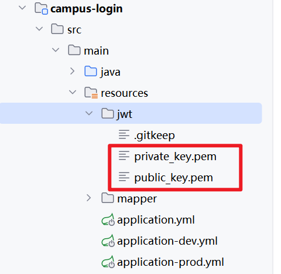

## JWT

### 公钥私钥



| 文件                          | 用途                                                         | 安全性要求                   |
| ----------------------------- | ------------------------------------------------------------ | ---------------------------- |
| **`private_key.pem`（私钥）** | **签发 Token** — 服务端用私钥对 Access Token 进行 RSA 签名，证明 Token 由本服务合法签发 | 必须严格保密，只存放在服务端 |
| **`public_key.pem`（公钥）**  | **验证 Token** — 服务端（或其它微服务）用公钥验证 Access Token 的签名是否有效 | 可以分发，不需保密           |

#### 在项目中的使用方式

从 `application.yml` 配置可以看到：

```yaml
jwt:
  private-key-path: classpath:jwt/private_key.pem
  public-key-path: classpath:jwt/public_key.pem
  access-token-expiration: 15      # Access Token 有效期 15 分钟
  refresh-token-expiration: 10080  # Refresh Token 有效期 7 天
```

工作流程（根据项目设计文档）：

1. **用户登录成功** → 服务端用 `private_key.pem` 签发一个短期的 **Access Token**（15 分钟有效，RSA 签名），同时生成一个长期的 **Refresh Token**（7 天，存 Redis）
2. **用户后续请求** → 请求头带 `Bearer {Access Token}`，服务端用 `public_key.pem` 验签后解析出用户信息，无需查数据库
3. **Access Token 过期** → 客户端用 Refresh Token 换新的 Access Token（Token 轮换机制）

#### 为什么用 RSA 非对称加密？

相比对称加密（一个密钥既签发又验证），非对称加密的好处是：**公钥可以安全地分发给其他微服务**，让它们也能独立验证 Token，而不需要持有私钥——私钥只存在于认证服务中，安全性更高。


---

## 双Token机制（Access Token + Refresh Token）

### 一句话理解

**Access Token 是"临时通行证"（短有效期），Refresh Token 是"换证凭证"（长有效期）。** 通行证过期了不需要重新登录，用换证凭证去换一张新的通行证即可。

---

### 为什么需要两个 Token？

如果只有一个 Token，面临**两难选择**：

| 策略 | 问题 |
|------|------|
| **Token 有效期短（15分钟）** | 用户频繁掉线，体验极差 |
| **Token 有效期长（30天）** | Token 一旦泄露，攻击者可以长期冒充用户，且无法在服务端主动撤销 |

**双Token方案解决了这对矛盾：**

```
Access Token（短，15分钟） → 每次请求携带，泄露后影响窗口小
Refresh Token（长，7天）   → 只在刷新时用一次，存在 Redis 可随时撤销
```

---

### 两种 Token 的本质差异

| 维度 | Access Token | Refresh Token |
|------|-------------|---------------|
| **类比** | 临时通行证 | 换证凭证 |
| **有效期** | 15 分钟 | 7 天 |
| **携带数据** | userId + username + roles | **仅 userId** |
| **使用频率** | 每次API请求（高频） | 每15分钟一次（低频） |
| **存储位置** | 仅客户端 | 客户端 + **Redis服务端** |
| **可撤销** | 否（无状态JWT无法撤销） | 是（删除Redis即可） |
| **泄露危害** | 15分钟内有效 | 需要同时通过Redis校验 |

---

### 为什么 Access Token 带 username + roles，Refresh Token 只带 userId？

这是一个精妙的**数据分层策略**：

```
Access Token（带 claims）—— 追求性能
  └─ JwtAuthenticationFilter 直接从 JWT 取出 username、roles 设置 SecurityContext
  └─ 无需每次请求都查数据库

Refresh Token（只带 userId）—— 追求数据新鲜度
  └─ 刷新时无论如何都要查数据库校验用户状态
  └─ 顺带拿最新 username、roles → 保证7天内角色变更实时生效
  └─ 即使 Refresh Token 泄露，攻击者也看不到用户名和角色
```

| | Access Token | Refresh Token |
|--|-------------|---------------|
| **原则** | 高频数据缓存 | 低频数据实时查 |
| **数据库依赖** | 不查库 | 刷新时查库 |
| **权限时效性** | 旧权限最多存活15分钟 | 刷新时立即获取最新权限 |

---

### 完整工作流程

#### 1. 登录阶段

```
客户端                                 服务端
  │                                      │
  │──── POST /api/admin/auth/login ─────→│
  │     { username, password }           │
  │                                      │── BCrypt 密码比对
  │                                      │── 查询角色列表
  │                                      │── 生成 AccessToken(15min)  ← RSA私钥签名
  │                                      │── 生成 RefreshToken(7day)  ← RSA私钥签名
  │                                      │── storeRefreshToken(Redis) ← refresh_token:{userId}
  │←──── LoginResponse ─────────────────│
  │     { accessToken, refreshToken }    │
  │                                      │
  │  前端存储两个Token（localStorage / cookie）
```

#### 2. 正常请求阶段

```
客户端                                   服务端
  │                                        │
  │── GET /api/admin/users ───────────────→│
  │   Authorization: Bearer {accessToken}  │
  │                                        │── JwtAuthenticationFilter
  │                                        │   ├─ 公钥验签 → 提取 username, roles
  │                                        │   ├─ 设置 SecurityContext
  │                                        │   └─ ⚠️ 不查数据库！
  │←──── 200 OK ──────────────────────────│
```

#### 3. Token 刷新阶段（核心：Token 轮换 Rotation）

```
客户端                                    服务端
  │                                         │
  │  AccessToken 过期，收到 401             │
  │                                         │
  │── POST /api/admin/auth/refresh ────────→│
  │   { refreshToken: "xxx" }              │
  │                                         │── ① JWT验签（RSA公钥）
  │                                         │── ② 提取 userId
  │                                         │── ③ Redis比对 refresh_token:{userId}
  │                                         │      ≠ → 401 "已被使用或失效"
  │                                         │      = → 继续
  │                                         │── ④ 查数据库校验用户状态
  │                                         │── ⑤ 生成新 AccessToken + 新 RefreshToken
  │                                         │── ⑥ 覆盖 Redis ← 旧Token立即失效！
  │←── LoginResponse ──────────────────────│
  │   { accessToken, refreshToken }         │
  │                                         │
  │  ⚡ 旧的 RefreshToken 已不可用（Rotation防护）
```

**Token 轮换的安全性：** 即使攻击者截获了旧的 RefreshToken，一旦用户刷新过，攻击者的旧Token立即失效——因为 Redis 里存的已经是新Token了。

---

### Redis Key 设计

```
Key:   refresh_token:{userId}
Value: RefreshToken 的 JWT 字符串
TTL:   7天（与 RefreshToken 有效期一致）

为什么用 userId 作 Key 而不是 token 作 Key？
  └─ 覆盖写语义：同一个用户只有一份有效 RefreshToken
  └─ 新登录 → 旧 RefreshToken 自动失效
  └─ 刷新后 → 旧 RefreshToken 自动失效（轮换）
```

---

### TokenService 核心方法

```java
// 登录时调用：存储 Refresh Token
storeRefreshToken(userId, refreshToken)  → SET refresh_token:{userId} {token} EX 10080m

// 刷新时调用：校验 + 轮换
validateRefreshToken(userId, refreshToken) → GET refresh_token:{userId} → 比对

// 登出/强制下线时调用
deleteRefreshToken(userId) → DEL refresh_token:{userId}
```

---

### 安全性总结

| 安全措施 | 说明 |
|----------|------|
| **双Token分离** | AccessToken短有效期（15min）限制泄露窗口；RefreshToken长有效期 + 服务端校验 |
| **Token 轮换** | 每次刷新都换新的RefreshToken，旧Token立即失效 → 防止重放攻击 |
| **Redis 服务端存储** | RefreshToken 存在 Redis，可随时删除强制用户下线 |
| **RSA 非对称签名** | 即使 RefreshToken 被偷，攻击者也看不到 userId（加密保护，实际是签名可解析的），但无法伪造 |
| **状态校验** | 刷新时重新查库，确保被禁用/删除的用户无法续期 |
| **覆盖写** | 同一userId只能有一个有效RefreshToken，新登录会使旧Token失效 |

---

### 前后端约定

```
前端职责：
  ├─ 存储 accessToken + refreshToken（如 localStorage）
  ├─ 每次请求携带 accessToken → Authorization: Bearer {accessToken}
  ├─ 收到 401 → 自动调用 /refresh 接口
  ├─ 刷新成功 → 更新本地 Token → 重试原请求
  └─ 刷新失败 → 跳转登录页

后端职责：
  ├─ JwtAuthenticationFilter 解析 accessToken → 不查库，直接放行
  ├─ /refresh 接口接收 refreshToken → Redis校验 → 查库 → 轮换
  └─ 主动撤销场景（封号等）→ deleteRefreshToken(userId)
```